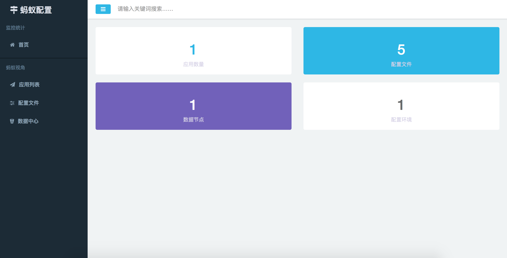
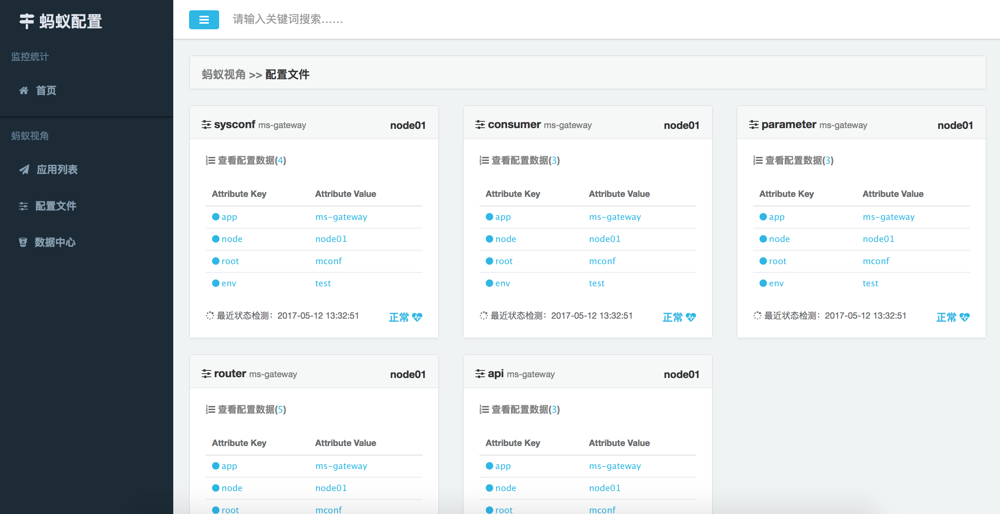
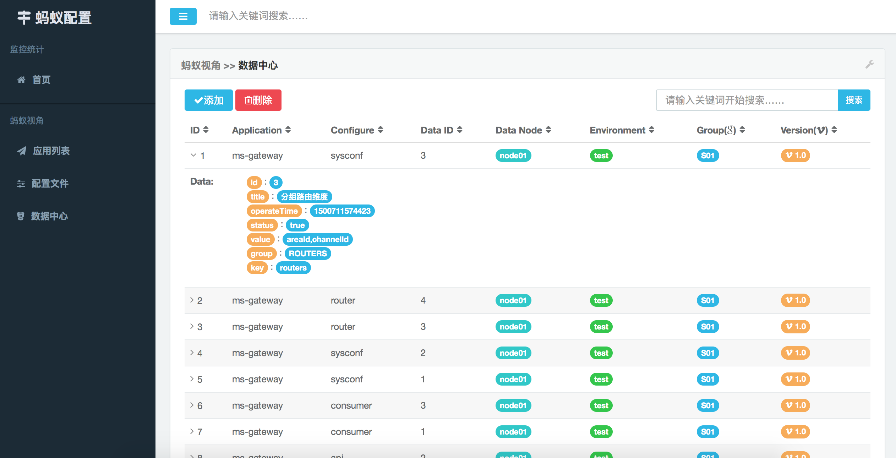

# 配置中心(Mconf)

[](LICENSE)
[](https://github.com/yu120/mconf/pulls)
[](https://github.com/yu120/mconf)
[](https://github.com/yu120/mconf)
[](https://github.com/yu120/mconf)

## 开源产品介绍（微服务基础设施<font color="red">QQ交流群：191958521</font>）
+ 配置中心(mconf)

1. GITHUB：https://github.com/yu120/mconf
2. 码云：https://git.oschina.net/yu120/mconf

+ 微核心(micro)

1. GITHUB：https://github.com/yu120/micro
2. 码云：https://git.oschina.net/yu120/micro

+ 微服务神经元(neural)

1. GITHUB：https://github.com/yu120/neural
2. 码云：https://git.oschina.net/yu120/neural

+ 微序列(sequence)

1. https://git.oschina.net/yu120/sequence


## 1 概述
在分布式微服务架构中,当应用数量和各个应用部署实例的数量较多时,如果还是手动去实现配置信息的修改或数据的迁移等,其效率是很低的。且认为手动操作的也有可能出现错误的情况,从而引发应用发布错地方、启动不了、发不通等情况。

为了解决以上问题,开发了基于Zookeeper的配置中心(微服务配置中心:mconf),用于解决以上问题。同时新引入了微服务配置中心也为架构带来了运维成本和故障风险。因此建议不要强制依赖mconf,即没有mconf也能正常使用,当然有了mconf更好,可以为我们解决很多繁琐的事情。mconf依赖的Zookeeper可以靠集群来实现高可用,但mconf本身的问题也是可能存在的,所以使用请慎重。

## 2 配置接口
### 2.1 基本接口

```java
void connect(URL url);//Connect configuration center
boolean available();//Configuration center status
```

### 2.2 操作接口

```java
void addConf(Cmd cmd, Object obj);//The Add Configuration Data.
void delConf(Cmd cmd);//The Delete Configuration Data.
void upConf(Cmd cmd, Object obj);//The Update Configuration Data.
<T> T pull(Cmd cmd, Class<T> cls);//The Pull Configuration Data.
<T> List<T> pulls(Cmd cmd, Class<T> cls);//The Pulls Configuration Data.
<T> void push(Cmd cmd, Class<T> cls, Notify<T> notify);//The Push Configuration Data.
void unpush(Cmd cmd);//The UnPush Configuration Data.
```

### 2.3 统计接口

```java
List<DataConf> getApps();//The Get Apps.
List<DataConf> getConfs();//The Get Confs.
List<DataConf> getDataBodys();//The Get Data Body.
```

## 3 数据结构
### 3.1 连接URL

连接配置中心的URL格式：

> [zookeeper/redis] ://127.0.0.1:2181/mconf?node=[node]&app=[app]&env=[env]&conf=[conf]&category=[category]&version=[version]&data=[data]&……

####3.1.1 Zookeeper

+ timeout：连接超时时间，单位为ms，默认值60000ms
+ session：数据过期清理时间，单位为ms，默认值6000ms

####3.1.2 Redis

+ retryPeriod：数据变更探测周期，单位为ms，默认值10000ms

### 3.2 数据存储结构
#### 3.2.1 Zookeeper
用curator来实现Zookeeper的操作。使用PATH节点来表示配置所属的相关信息，使用最后一层PATH的DATA区来存储JSON结构的配置数据。

```
第1层PATH：/mconf?……
第2层PATH：/[app]?node=[node]&……
第3层PATH：/[conf]?env=[env]&group=[group]&version=[version]&……
第4层PATH：/[data]?……
第4层DATA：{JSON Data String}
```

完整PATH格式：

> /mconf?……/[app]?node=[node]&……/[conf]?env=[env]&group=[group]&version=[version]&……/[data]?……

#### 3.2.2 Redis
Redis使用Map结构来存储配置信息。

```
Key：/mconf?……/[app]?node=[node]&……/[conf]?env=[env]&group=[group]&version=[version]&……
Field：[data]?……
Value：{JSON Data String}
```

## 4 可视化管理界面








## 5 功能范围
+ mconf不支持多版本(version)、多场景(group)和多环境(env)。
+ mconf暂不支持本地缓存配置未离线文件,后期会考虑将拉下来的配置信息缓存到离线文件,解决对Zookeeper的强依赖问题。

